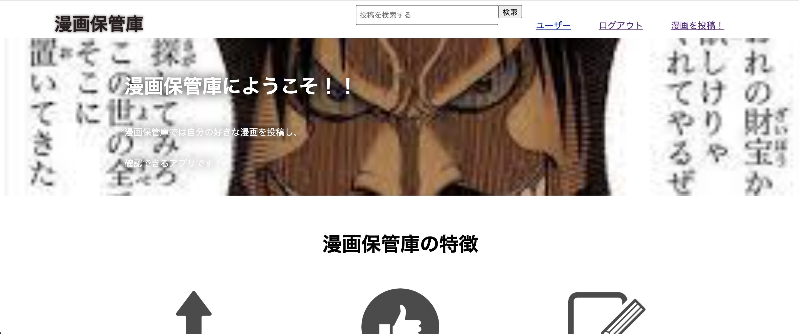

# 漫画保管庫 

## 概要 
漫画の画像を投稿。漫画画像を投稿することで気になる漫画を視覚的に理解させる事が目的。

### 本番環境 
デプロイ先 : Heroku 
テストアカウント : test@com 
パスワード : 123456

#### 制作背景 
気に入った漫画をメモに残す際、文字だけだとどんな漫画か忘れてしまう事があった。 
漫画を画像付きで投稿することでどんな漫画だったかを画像で理解し、気になる漫画を保存できるのではと考えアプリを作成した。

##### 詳細な説明 
・漫画を投稿すると自分が投稿してきた漫画がマイページにて表示される。 
・投稿したすべての漫画はTopページから他ユーザーも閲覧可能。 
・投稿した漫画から気になるものがあればいいねする事が可能。 
・いいねした漫画はマイページに保存される。 
・投稿した漫画を検索する検索機能の実装。

###### 使用技術 
Ruby,HTML,CSS,Github,AWS S3

## 今後の実装
・javascriptを用いた動きのあるビューの作成 
・対象とする漫画に複数のコメントをすることができる機能 
・ビューの整形(ログイン及びサインイン画面を特に) 
・viewportの整形 
・スマホ対応

## users テーブル

  | Column                | type   | Options                   |
  | --------------------- | ------ | ------------------------- |
  | nickname              | string | null: false               |
  | email                 | string | null: false, unique: true |
  | encrypted_password    | string | null: false               |
  | birthday              | date   | null: false               |

### Association
  has_many :comics 
  has_many :likes

## comics テーブル

  | Column                | type       | Options                        |
  | --------------------- | ---------- | ------------------------------ |
  | title                 | string     | null: false                    |
  | genre                 | string     | null: false                    |
  | user                  | references | null: false, foreign_key: true |
### Association
  has_many   :likes 
  belong_to :user

## likes テーブル

  | Column                | type       | Options                            |
  | --------------------- | ---------- | ---------------------------------- |
  | user                  | references | null: false, foreign_key: true     |
  | comic                 | references | null: false, foreign_key: true     |

### Association
  belong_to :user 
  belong_to :comic
